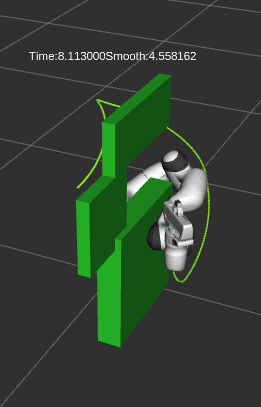

# Benchmarking-based-on-MoveIT2
This is a ROS2 package that is mainly used for benchmarking. The package is the basic version which is used to compare different motion planning algorithms in different conditions. There are 15 test cases in total, and are tested under three scenarious: no obstacle(simplest case), with a single obstacle, and narrow space(a common case for robotics benchmarking). The comparison is accomplished for 5 planner architectures: OMPL(open library for basic sampling based motion planning algorithms), CHOMP, STOMP, OMPL+CHOMP(OMPL as pre-planner and CHOMP as post-optimizer), OMPL+STOMP. There are three important criterias for this benchmarking. The first one is time-consumption for generating plan, the second one is the metric of smoothness(calculated by finding the maximum difference between two adjacent discretized points of a trajectory), and the last one is whether the planning is successful or not. The time consumption and smoothness are shown as a marker above the robotic arm, and whether the planning is successful is noted in terminal. The trajectory of the end-effector is also shown in RViz.

<p align="middle">
  
   
  
</p>

## Good for
* Provide basic benchmarking for general motion planning algorithms
* Can be easily extend for further use
* Constraints would be added

## 15 Test cases
1. Test case 1: OMPL + no obstacle
2. Test case 2: CHOMP + no obstacle
3. Test case 3: STOMP + no obstacle
4. Test case 4: OMPL+CHOMP + no obstacle
5. Test case 5: OMPL+STOMP + no obstacle
6. Test case 6: OMPL + single obstacle
7. Test case 7: CHOMP + single obstacle
8. Test case 8: STOMP + single obstacle
9. Test case 9: OMPL+CHOMP + single obstacle
10. Test case 10: OMPL+STOMP + single obstacle
11. Test case 11: OMPL + narrow space
12. Test case 12: CHOMP + narrow space
13. Test case 13: STOMP + narrow space
14. Test case 14: OMPL+CHOMP + narrow space
15. Test case 15: OMPL+STOMP + narrow space
## Set Up
This [ROS2](https://docs.ros.org/en/humble/Installation/Alternatives/Ubuntu-Install-Binary.html) package is mainly used to interact with [RViz](https://moveit.picknik.ai/humble/doc/tutorials/quickstart_in_rviz/quickstart_in_rviz_tutorial.html) based on [MoveIT 2](https://moveit.ros.org/install-moveit2/binary/). So to use this package, the moveit2 package and tutorials should already be installed and built.

1. Move into the **src** folder of workspace for moveit2, which is normally named as **ws_moveit2**
```bash
cd ~/ws_moveit2/src
```
2. Clone the code into this folder and name it, for example hello_moveit
```bash
git clone https://github.com/Jubo-Xu/Benchmarking-based-on-MoveIT2.git
```
3. Back to the workspace
```bash
cd ..
```
4. source the workspace and using colcon to build the whole project
```bash
source /opt/ros/humble/setup.bash
colcon build --mixin debug
```
5. open another terminal, source it, and launch the RViz first
```bash
ros2 launch moveit2_tutorials demo.launch.py
```
6. uncheck the **MotionPlanning** box in RViz  

  

7. Add a new panel from **Panels** on the top of RViz  


8. Add a new marker array by clicking the **Add** button below  


9. Change the topic of markerarray to **/rviz_visual_tools**  


10. open a new terminal, source it, and run the package, the last argument is the test case to be tested
```bash
ros2 run hello_moveit hello_moveit --ros-args -r __node:=hello_moveit -- <testcase>
```
11. Follow the instruction on this terminal and generate the plan and execute it by cliking **Next** button below

